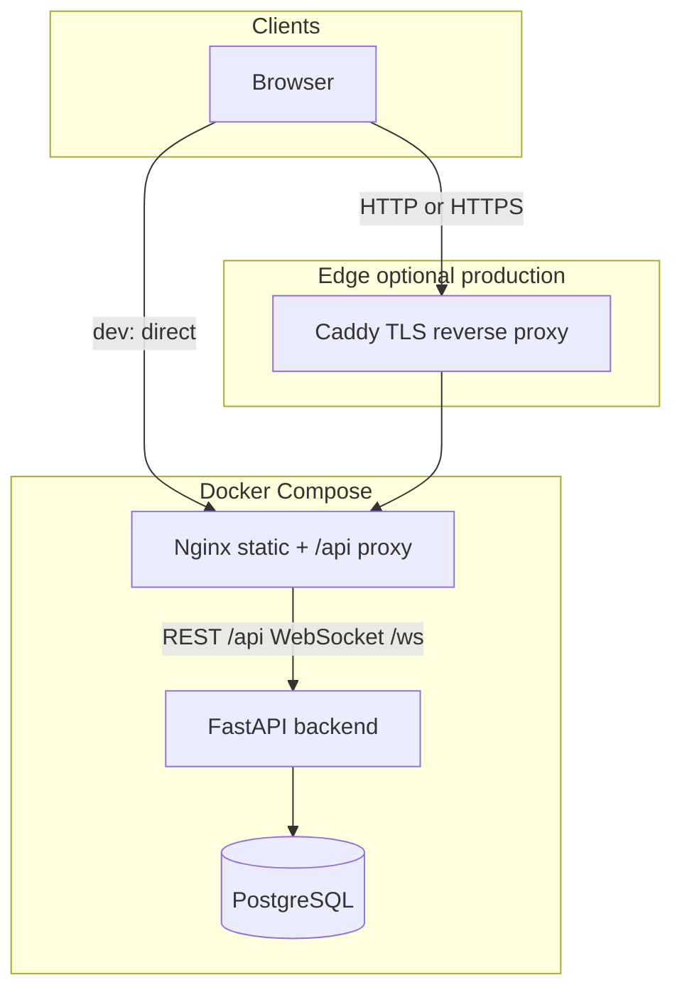
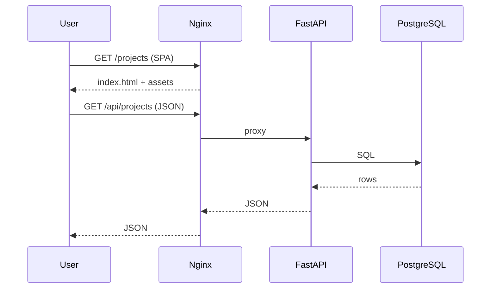

# Architecture

Bezum Platform is a single repository with a clear split between UI, API, data, and infrastructure.

## High-level diagram

## Request paths

1. **Browser → Nginx (port 8080 in dev)** serves the React SPA (`try_files` + `index.html` for client routing).
2. **Same origin `/api` and `/ws`** are proxied by Nginx to **FastAPI** (`backend:8000`), so the frontend uses relative URLs and avoids CORS issues in normal operation.
3. **FastAPI** uses **SQLAlchemy (async)** with **PostgreSQL**; **Alembic** runs migrations on startup.
4. **Production with Caddy**: only **80/443** are exposed publicly; Caddy terminates TLS and forwards to **Nginx** (`frontend:80`). Backend is not exposed on the host.

## Compose layouts

| Mode | Files | Notes |
|------|--------|------|
| Base | `docker-compose.yml` | Internal network only; no host ports on backend/frontend |
| Local dev | `+ docker-compose.override.yml` (from `docker-compose.override.example.yml`) | Host ports `8001`/`8080`, bind mount, `--reload` |
| Production | `-f docker-compose.yml -f docker-compose.prod.yml` | Caddy on `80`/`443`; override file must not be used on the server |

## Data flow (example)

## Security notes

- Set a strong `SECRET_KEY` and unique `POSTGRES_PASSWORD` in production.
- Do not commit `.env`; use `.env.production.example` as a template only.
- Ensure DNS for `DOMAIN` points to the server before relying on Let's Encrypt.
