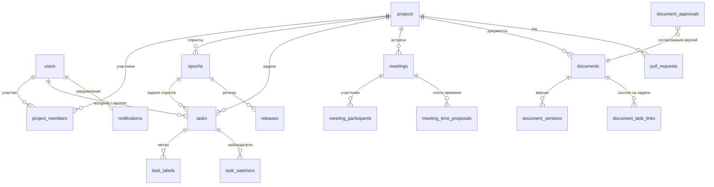

# Схема базы данных Seamless

## Роли и доступ

### Глобальная роль пользователя (`users.role`, enum `userrole`)

| Значение    | Назначение |
|------------|------------|
| `admin`    | Полный доступ ко всем проектам, список проектов как у менеджера, API `/api/admin/*`. |
| `manager`  | Видит все проекты; при входе в проект без строки в `project_members` подставляется виртуальная роль менеджера в проекте. |
| `developer` | Только проекты, где есть запись в `project_members`. |
| `customer`  | Только проекты из `project_members`; в API часто ограничен (например, без прав менеджера/разработчика на изменение CI/CD). |

Регистрация с ролью `admin` запрещена; администратора задают через БД, сиды или админ-панель.

### Роль в проекте (`project_members.role`, enum `projectmemberrole`)

| Значение    | Назначение |
|------------|------------|
| `manager`  | Управление участниками, спринтами, документами с ограниченной видимостью и т.д. (см. роутеры). |
| `developer`| Задачи, документы `managers_devs`, встречи (создание — у менеджера/разработчика). |
| `customer` | Обычно чтение и участие по политике видимости документов и задач. |

Связь: **пользователь** ↔ **проект** через таблицу `project_members` (составной ключ `project_id`, `user_id`). Задачи, документы, встречи и спринты привязаны к `project_id` (и при необходимости к `epoch_id` / `task_id`).

## Сущности (ER)

## Основные таблицы

| Таблица | Описание |
|---------|----------|
| `users` | Учётные записи, `role`, `is_active`. |
| `projects` | Проекты, статус, `gitlab_repo_url`. |
| `project_members` | Участие пользователя в проекте с ролью в проекте. |
| `epochs` | Спринты (даты, статус, цели). |
| `tasks` | Канбан-задачи, статус, `epoch_id`, исполнитель, автор. |
| `task_labels`, `task_watchers` | Метки и наблюдатели задач. |
| `meetings` | Встречи, `jitsi_room_id`, транскрипт, саммари. |
| `meeting_participants`, `meeting_time_proposals` | RSVP и согласование времени. |
| `documents`, `document_versions` | Документы и версии (JSON-контент). |
| `document_task_links` | Связь документ ↔ задача. |
| `document_approvals` | Решения по версиям документов. |
| `pull_requests` | PR из GitLab. |
| `releases` | Релизы спринта. |
| `notifications` | Уведомления пользователей. |

Комментарии к задачам в API могут быть заглушками до появления отдельной таблицы.

## Видео

Комната Jitsi хранится в `meetings.jitsi_room_id`. URL для iframe: `https://{JITSI_DOMAIN}/{jitsi_room_id}` (домен задаётся `JITSI_DOMAIN` в конфиге бэкенда).
